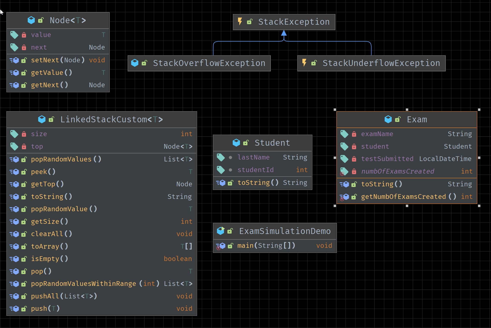
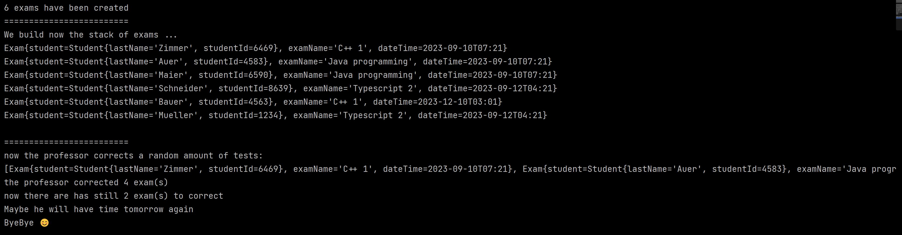

## Linked Stack exercise

#### A. Try to translate the following UML diagram into code:

Start with writing the generic class for the Stack. This time it is not implemented via an Array (as we have done it together in the past) but rather via a LinkedList.
Please note the `throws <exception>` code at the method signatures and don't forget to throw the exception(s) that is defined.
There are two exceptions:
1. StackUnderflowException: this has to be thrown if the stack is empty (e.g. pop from an empty stack)
2. StackOverflowException: this has to be thrown if the stack grows too large (e.g. not more than 1 000 000 elements)

Please add a constructor to both exceptions that you can also pass an error message.
When you throw an exception always provide a proper error message to the user.

For all the methods in general, please also note the small comments written above some methods.

#### B. Create the Exam simulation Demo
Now create the Exam simulation Demo where you can already see some code. the output should look like the following:

Feel free to change the simulation, improve it and adapt it to your needs.
The demo should be extended so that you use ALL methods of the stack

#### C. Use try-catch or alternatively rethrow the exception
Similar to our last review session, try to handle exceptions in two different ways:
1. use a try-catch block and handle the exception gracefully.
   try to add at least two examples in a demo where the user triggers some exception.
   Also try to make use of a multicatch and the finally clause.
2. rethrow the exception

#### D. Besides exam, try to find any other data type where you test the stack and write a demo simulation

